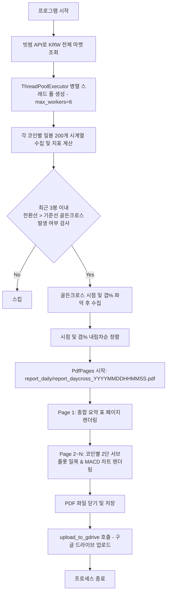

# export_daycross_ichimoku_pdf.py 프로세스 및 기술 문서

## 1. 개요 (Overview)

`export_daycross_ichimoku_pdf.py` 스크립트는 **빗썸(Bithumb) 원화(KRW) 마켓 전 코인**을 대상으로 **일봉(Daily)** 시계열 데이터를 수집하여, **일목균형표 상 전환선(9)이 기준선(26)을 상향돌파(골든크로스)**하는 강세 전환 시그널 코인을 자동으로 탐색하고 분석 결과와 차트를 포함한 PDF 리포트로 자동 생성하는 프로그램입니다.

생성된 PDF 리포트는 `report_daily/` 디렉터리에 타임스탬프 파일명 형태로 저장되며, 구글 드라이브 업로드 연동 기능을 제공합니다.

---

## 2. 골든크로스(Golden Cross) 포착 조건

최근 3개 일봉 시계열($t-2, t-1, t$) 범위 내에서 아래의 조건이 발생한 코인을 포착합니다.

```
                   [ 일목균형표 일봉 골든크로스 조건 ]
┌──────────────────────────────────────────────────────────────┐
│  • 직전 봉 (t - 1) : 전환선(9) <= 기준선(26)                 │
│  • 현재 봉 (t)     : 전환선(9) > 기준선(26)                  │
└──────────────────────────────────────────────────────────────┘
```

| 포착 시점 구분 | 검증 로직 | 설명 |
| :--- | :--- | :--- |
| **오늘 (현재봉)** | `df[-2] tenkan <= kijun` AND `df[-1] tenkan > kijun` | 당일 진행 중이거나 당일 마감 봉에서 골든크로스 발생 |
| **1일 전** | `df[-3] tenkan <= kijun` AND `df[-2] tenkan > kijun` | 어제 일봉에서 골든크로스 발생 |
| **2일 전** | `df[-4] tenkan <= kijun` AND `df[-3] tenkan > kijun` | 그저께 일봉에서 골든크로스 발생 |

---

## 3. 프로세스 동작 흐름도 (Data & Execution Flow)



---

## 4. 주요 함수 및 모듈 구조

### 4.1. 데이터 수집 및 지표 계산 모듈
* **`get_krw_markets()`**: 빗썸 REST API(`https://api.bithumb.com/v1/market/all`)에서 원화 마켓 목록을 조회합니다.
* **`calc_mid_point(high, low, window)`**: $N$기간(9, 26, 52) 최고가와 최저가의 중간값을 산출합니다.
* **`calc_rsi(series, period=14)`**: Wilder's Smoothing 방식 RSI(14)를 계산합니다.
* **`calc_macd(series, short=12, long=26, signal=9)`**: EMA 기반 MACD Line, Signal Line, MACD Histogram을 계산합니다.
* **`get_slope_and_angle(arr)`**: 최근 10봉 기준 지표선의 정규화 기울기 각도(도, Degree)를 산출합니다.
* **`process_daily_candle_df(data)`**: 캔들 데이터를 Pandas DataFrame으로 변환 후 전환선, 기준선, 선행스팬1/2, RSI, MACD 지표를 통합 생성합니다.

### 4.2. 골든크로스 분석 및 리포트 모듈
* **`fetch_and_analyze_single_coin_daycross(m, count=200, lookback_bars=3)`**:
  * 단일 코인의 일봉 데이터를 수집하고 최근 3일간 골든크로스가 일어났는지 시계열 순으로 검사하여 포착 데이터를 반환합니다.
* **`generate_daycross_pdf_report(pdf_path, max_coins, max_workers, upload_gdrive)`**:
  * 멀티스레드로 전 마켓을 수집하고 Matplotlib `PdfPages`를 통해 PDF 문서를 구성 및 출력합니다.

---

## 5. PDF 리포트 출력 디자인 사양

| 페이지 레이아웃 | 구성 요소 | 상세 내용 |
| :--- | :--- | :--- |
| **요약 표 페이지** | **전체 통계 표 (Table)** | • 제목: 빗썸 일목균형표 일봉 전환선-기준선 골든크로스 포착 리포트<br>• 컬럼: 마켓코드, 한글명, 영문명, 현재가, 전환선(9), 기준선(26), 전환-기준 갭(%), 크로스 시점, RSI, MACD, 구름대 위치 |
| **개별 코인 차트 페이지**<br>*(1코인 1페이지)* | **[상단 서브플롯] 일봉 일목균형표 차트** | • 종가 선, 전환선(Red), 기준선(Blue), 선행스팬1(Green), 선행스팬2(Orange)<br>• 양운(녹색)/음운(분홍) 구름대 음영<br>• **골든크로스 발생 지점 황금색 마커(Marker) 강조 표시** |
| | **[하단 서브플롯] 일봉 MACD 차트** | • MACD Line(Blue), Signal Line(Red), Oscillator Histogram 바 차트 |

---

## 6. 실행 방법 (Usage)

### 6.1. 기본 PDF 리포트 생성
터미널에서 직접 파이썬 스크립트를 실행합니다.

```bash
python export_daycross_ichimoku_pdf.py
```

### 6.2. 코드 모듈 임포트 사용

```python
from export_daycross_ichimoku_pdf import generate_daycross_pdf_report

# 일봉 골든크로스 코인 스캔 및 PDF 리포트 파일 생성
pdf_path = generate_daycross_pdf_report(max_workers=6, upload_gdrive=False)
print(f"리포트 경로: {pdf_path}")
```

---

## 7. 결과 파일 및 저장 경로

* **저장 디렉터리**: `d:/pyprj/coinsts/report_daily/`
* **파일명 포맷**: `report_daycross_YYYYMMDDHHMMSS.pdf` (예: `report_daycross_20260810135519.pdf`)
