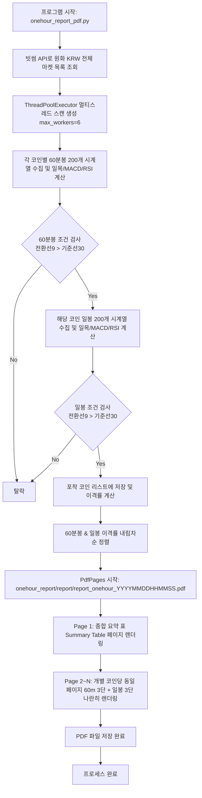

# onehour_report_pdf.py 프로세스 및 기술 문서

## 1. 개요 (Overview)

`onehour_report_pdf.py` 모듈은 **빗썸(Bithumb) 원화(KRW) 마켓에 상장된 전체 암호화폐**를 대상으로 **60분봉(1시간봉)** 및 **일봉(Daily)** 시계열 데이터를 수집·분석하여, 일목균형표 전환선이 기준선(30) 위에 위치한 강세 종목을 포착하고 **동일 페이지에 60분봉 & 일봉 3단 시각화(일목+진한 거래량, MACD, RSI)** PDF 리포트를 자동 생성하는 프로그램입니다.

생성된 PDF 리포트는 `onehour_report/report/` 디렉터리에 타임스탬프 파일명(`report_onehour_YYYYMMDDHHMMSS.pdf`) 형태로 자동 저장됩니다.

---

## 2. 코인 포착 핵심 조건

빗썸 전체 원화 마켓 코인을 스캔하여 다음 **2가지 핵심 조건이 모두 동시에 만족(AND)**되는 코인만 선별하여 리포트에 수록합니다.

```
                    [ 60분봉 & 일봉 듀얼 타임프레임 조건 ]
┌─────────────────────────────────────────────────────────────────────────────┐
│ 1. 60분봉 일목균형표 전환선(9봉) > 60분봉 일목균형표 기준선(30봉)            │
│ 2. 일봉 일목균형표 전환선(9봉) > 일봉 일목균형표 기준선(30봉)                │
└─────────────────────────────────────────────────────────────────────────────┘
```

| 타임프레임 | 핵심 지표 | 지표 파라미터 및 설명 |
| :--- | :--- | :--- |
| **60분봉 (1시간봉)** | **단기 골든크로스 / 정배열** | `전환선(9) > 기준선(30)` : 1시간 차원에서 단기 상승 모멘텀 우위 |
| **일봉 (Daily)** | **대세 상승 정배열** | `전환선(9) > 기준선(30)` : 상위 타임프레임 일봉 차원의 상승 추세 유지 |

---

## 3. 프로세스 동작 흐름도 (Data & Execution Flow)



---

## 4. PDF 리포트 구성 및 차트 시각화 레이아웃

### 4.1. 표지 및 종합 요약 표 페이지 (Page 1)
- 스캔 일시, 필터 조건, 전체 포착 종목 수 표기.
- 마켓코드, 한글명, 영문명, 현재가, 60m 전환선/기준선(30), 60m 이격률(%), 일봉 전환선/기준선(30), 일봉 이격률(%), 60m RSI, 60m MACD 요약 표 포함.

### 4.2. 코인별 동일 페이지 듀얼 3단 차트 레이아웃 (Page 2 ~ N)
한 페이지에 **좌/우 2열 x 3행 서브플롯**을 나란히 배치하여 60분봉과 일봉의 주가 흐름 및 보조지표를 입체적으로 비교 분석할 수 있습니다.

```
┌──────────────────────────────────────┬──────────────────────────────────────┐
│ [좌측] 60분봉 (1시간봉) 3단 시각화     │ [우측] 일봉 (Daily) 3단 시각화        │
├──────────────────────────────────────┼──────────────────────────────────────┤
│ 1단: 가격 + 일목균형표 + 진한 거래량 │ 1단: 가격 + 일목균형표 + 진한 거래량 │
├──────────────────────────────────────┼──────────────────────────────────────┤
│ 2단: MACD (12, 26, 9)                │ 2단: MACD (12, 26, 9)                │
├──────────────────────────────────────┼──────────────────────────────────────┤
│ 3단: RSI (14)                        │ 3단: RSI (14)                        │
└──────────────────────────────────────┴──────────────────────────────────────┘
```

#### 세부 차트 구성 요소:
1. **1단 (주가 & 일목균형표 & 거래량)**:
   - **종가 선**: 검은색 실선
   - **전환선(9봉)**: 빨간색 실선 (`#e31a1c`)
   - **기준선(30봉)**: 파란색 실선 (`#1f78b4`)
   - **선행스팬1 (30봉 시프트)**: 초록색 점선 (`#33a02c`)
   - **선행스팬2 (60봉/30봉 시프트)**: 주황색 점선 (`#ff7f00`)
   - **구름대**: 양운(연한 초록), 음운(연한 분홍) 채우기
   - **진한 거래량 (TwinX)**: 상승 봉은 진한 빨강(` #c0392b`), 하락 봉은 진한 파랑(` #2980b9`), 불투명도 `alpha=0.65` 적용
2. **2단 (MACD)**:
   - MACD 선(파랑), Signal 선(빨강 점선), Oscillator 히스토그램 바(상승 빨강 / 하락 파랑)
3. **3단 (RSI)**:
   - RSI(14) 보라색 실선, 과매수(70) 빨강 점선, 과매도(30) 파랑 점선

---

## 5. 모듈 구조 및 파일 위치

```
d:\pyprj\coinsts\
├── onehour_report_pdf.py           # [메인 스크립트] 루트 실행 모듈
└── onehour_report/
    ├── onehour_report_pdf.py       # [모듈 래퍼] 하위 디렉터리 실행용
    ├── report_onhour_pdf.py        # [호환 래퍼] 기존 모듈 연결용
    ├── onehour_report_pdf.md       # [기술 문서] 본 명세 문서
    └── report/                     # [PDF 저장 폴더]
        └── report_onehour_YYYYMMDDHHMMSS.pdf
```

---

## 6. 실행 방법

콘솔(터미널)에서 아래 명령어 중 하나를 실행합니다:

```bash
# 1. 루트 경로에서 실행
python onehour_report_pdf.py

# 2. onehour_report 디렉터리 경로 스크립트 실행
python onehour_report/onehour_report_pdf.py
```
