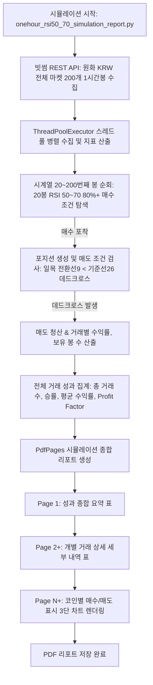

# onehour_rsi50_70_simulation_report.py 시뮬레이션 모듈 및 성과 기술 문서

## 1. 개요 (Overview)

`onehour_rsi50_70_simulation_report.py` 모듈은 **빗썸(Bithumb) 원화(KRW) 마켓에 상장된 전체 암호화폐**를 대상으로 최근 **200개 1시간봉(60분봉)** 시계열 데이터를 수집하여, 전략 기반의 **매수/매도 시뮬레이션(백테스팅)**을 수행하고 성과 지표(승률, 평균 수익률, 손익비, 최대 수익/손실률 등)를 분석하는 시스템입니다.

---

## 2. 시뮬레이션 매수 / 매도 알고리즘 규격

```
               [ 1시간봉 RSI 50~70 (80%+) 매수 & 일목 데드크로스 매도 시뮬레이션 규격 ]
┌────────────────────────────────────────────────────────────────────────────────────────┐
│ 1. 백테스팅 타깃: 빗썸 원화(KRW) 마켓 전체 코인 (최근 200개 1시간봉)                     │
│ 2. 매수 로직 (Buy Entry):                                                              │
│    - N번째 1시간봉 기준 최근 20개봉 (N-19 ~ N) 중 50.0 <= RSI(14) <= 70.0 만족 봉 수 >= 16개 │
│    - 미보유 상태 시 해당 조건 만족 봉(N번째 봉) 종가로 매수 진입                           │
│ 3. 매도 로직 (Sell Exit):                                                              │
│    - 보유 상태 시 일목균형표 전환선(9) < 기준선(26) (하향 돌파/데드크로스) 발생 시 매도    │
│    - 200번째 봉까지 포지션 미청산 시 200번째 봉 종가로 강제 청산                            │
│ 4. 산출 메트릭: 승률(%), 거래당 평균 수익률(%), 손익비(Profit Factor), 최대 수익/손실률     │
└────────────────────────────────────────────────────────────────────────────────────────┘
```

---

## 3. 시뮬레이션 데이터 및 실행 흐름도



---

## 4. PDF 성과 리포트 구성

### 4.1. 성과 종합 요약 표 페이지 (Page 1)
- 분석 대상 코인 수, 거래 발생 코인 수, 총 거래 횟수 표기
- **전체 승률 (Win Rate %)**, **거래당 평균 수익률 (%)**, **손익비 (Profit Factor)**, **최대 수익률 / 최대 손실률 (%)**, **평균 포지션 보유 시간(시간)** 수록
- 상위/하위 코인별 시뮬레이션 성과 요약 표 수록

### 4.2. 개별 거래 상세 세부 내역 표 페이지
- 실행된 모든 매수/매도 거래의 마켓코드, 코인명, 매수가, 매도가, 수익률(%), 보유시간, 진입/청산 시점, 청산 사유 수록

### 4.3. 코인별 시뮬레이션 차트 페이지
- 각 거래 발생 코인의 60분봉 3단 서브플롯:
  - **1단**: 가격 + 일목 전환선/기준선 + 거래량 + 매수($\blacktriangle$, 녹색) / 매도($\blacktriangledown$, 붉은색) 마커 및 매수-매도 연결선
  - **2단**: MACD
  - **3단**: RSI(14) (50~70 주황색 음영 구간 표시)

---

## 5. 실행 방법

콘솔(터미널)에서 아래 명령어를 실행합니다:

```bash
# 1. 루트 래퍼 실행
python onehour_rsi50_70_simulation_report.py

# 2. direct 실행
python onehour_report/onehour_rsi50_70_simulation_report.py
```
