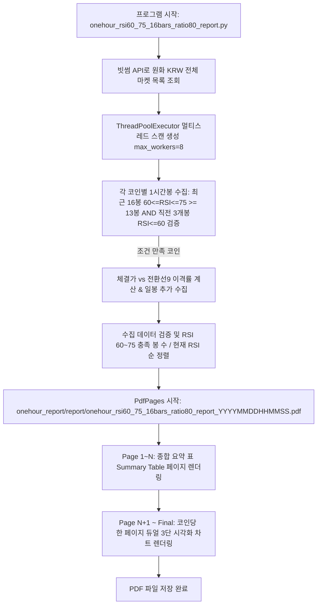

# onehour_rsi60_75_16bars_ratio80_report.py 프로세스 및 기술 문서

## 1. 개요 (Overview)

`onehour_rsi60_75_16bars_ratio80_report.py` 모듈은 **빗썸(Bithumb) 원화(KRW) 마켓 상장 전체 암호화폐**를 대상으로 **1시간봉(60분봉) 최근 16개봉 RSI(14) 60~75 범위 조건 80% 이상(13개봉 이상)** 및 **직전 3개봉(N-18, N-17, N-16 / 17~19번째 봉) RSI(14) <= 60.0 필터**를 동시 만족하는 신규 추세 돌파 코인을 포착하는 실시간 스크리닝 프로그램입니다.

생성된 PDF 리포트는 `onehour_report/report/` 디렉터리에 타임스탬프 파일명(`onehour_rsi60_75_16bars_ratio80_report_YYYYMMDDHHMMSS.pdf`) 형태로 자동 저장됩니다.

---

## 2. 수집 및 분석 규격

```
        [ 빗썸 1시간봉 최근 16개봉 RSI 60~75 (13봉+) & 직전 3봉 RSI<=60 포착 규격 ]
┌─────────────────────────────────────────────────────────────────────────────┐
│ 1. API 호출:                                                                │
│    - 1시간봉: https://api.bithumb.com/v1/candles/minutes/60?market={market}&count=200 │
│    - 일  봉: https://api.bithumb.com/v1/candles/days?market={market}&count=200       │
│ 2. 수집 대상: 빗썸 원화(KRW) 마켓 상장 전체 암호화폐                          │
│ 3. 조정된 포착 조건 (1시간봉 기준):                                         │
│    - ① 최근 16개 캔들 (N-15 ~ N) 중 60.0 <= RSI(14) <= 75.0 충족 봉 >= 13개  │
│    - ② [신규 필터]: 직전 3개 캔들 (N-18 ~ N-16) RSI(14) <= 60.0 모두 만족!    │
│ 4. 부가 정보:                                                               │
│    - 직전 3개봉 Max RSI 값 & 체결가 vs 일목 전환선(9) 이격률(%)            │
└─────────────────────────────────────────────────────────────────────────────┘
```

| 지표 항목 | 파라미터 및 설명 |
| :--- | :--- |
| **RSI (14)** | `Period=14` (RSI 선, 60~75 목표 구간 주황색 음영 하이라이트 및 75/60 기준선) |
| **직전 3봉 필터** | `N-18, N-17, N-16` (17~19번째 봉) RSI가 모두 60 이하인지 검증하여 횡보 후 신규 돌파 코인 선별 |
| **일목 전환선(9)** | `ConversionLine(9)` (체결가가 전환선 위인가 아래 이탈인가 검증) |
| **일목균형표** | `전환선(9봉)`, `기준선(26봉)`, `선행스팬1(26봉 시프트)`, `선행스팬2(52봉/26봉 시프트)` |
| **MACD** | `Short=12`, `Long=26`, `Signal=9` (MACD 선, Signal 선, Oscillator Histogram) |

---

## 3. 프로세스 동작 흐름도



---

## 4. 실행 방법

```bash
# 1. 루트 래퍼 실행
python onehour_rsi60_75_16bars_ratio80_report.py

# 2. direct 실행
python onehour_report/onehour_rsi60_75_16bars_ratio80_report.py
```
