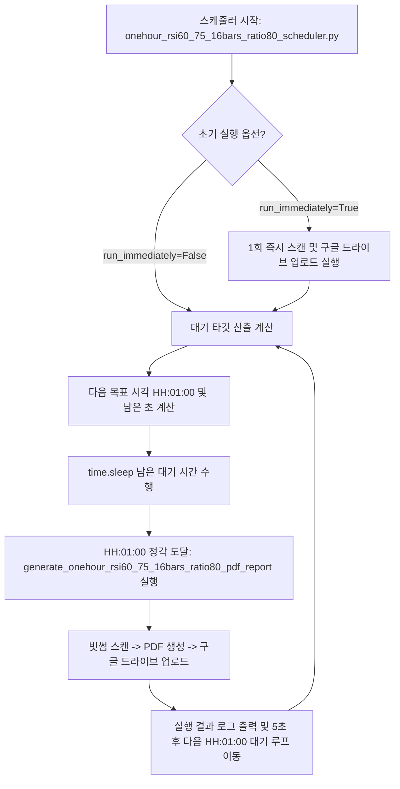

# onehour_rsi60_75_16bars_ratio80_scheduler.py 프로세스 및 기술 문서

## 1. 개요 (Overview)

`onehour_rsi60_75_16bars_ratio80_scheduler.py` 모듈은 **매시간 01분 00초(HH:01:00)** 정각마다 `onehour_rsi60_75_16bars_ratio80_report.py` 모듈을 자동으로 실행하도록 제어하는 상주형 서비스 스케줄러 스크립트입니다.

---

## 2. 스케줄링 작동 규격

```
        [ 매시간 01분 00초 (HH:01:00) 정각 자동 스케줄링 동작 방식 ]
┌─────────────────────────────────────────────────────────────────────────────┐
│ 1. 타깃 시간 계산:                                                         │
│    - 현재 시각 기준으로 다음 HH:01:00 시각까지 남은 대기 시간(초) 산출        │
│    - 예: 16:31:22 일 경우 -> 17:01:00 (1778초 / 29분 38초 대기)              │
│ 2. 대기 및 실행:                                                           │
│    - time.sleep(seconds_left) 대기 후 정각 01분 00초 도달 시 실행             │
│ 3. 작업 수행 내용:                                                          │
│    - 빗썸 476개 원화 코인 대상 최근 16봉 RSI 60~75 (80%+) & 직전3봉 RSI<=60 스캔│
│    - 듀얼 3단 시각화 PDF 리포트 생성 및 구글 드라이브(hhokyung@gmail.com) 업로드│
│ 4. 예외 및 연속성 처리:                                                     │
│    - API 일시적 네트워크 장애 발생 시에도 프로세스가 멈추지 않고 30초 대기 후 루프 지속│
└─────────────────────────────────────────────────────────────────────────────┘
```

---

## 3. 프로세스 동작 흐름도



---

## 4. 실행 방법

```bash
# 1. 루트 래퍼 실행 (상주 프로세스로 구동)
python onehour_rsi60_75_16bars_ratio80_scheduler.py

# 2. direct 실행
python onehour_report/onehour_rsi60_75_16bars_ratio80_scheduler.py
```
