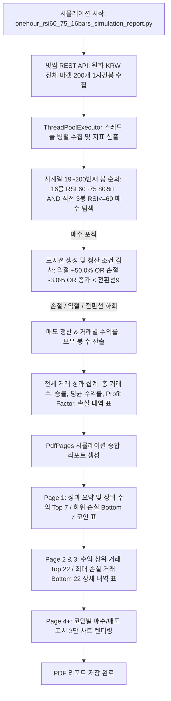

# onehour_rsi60_75_16bars_simulation_report.py 시뮬레이션 모듈 및 성과 기술 문서

## 1. 개요 (Overview)

`onehour_rsi60_75_16bars_simulation_report.py` 모듈은 **빗썸(Bithumb) 원화(KRW) 마켓 상장 전체 암호화폐**를 대상으로 최근 **200개 1시간봉(60분봉)** 시계열 데이터를 수집하여, **1시간봉 최근 16개봉 RSI(14) 60~75 비율 80% 이상(13개봉 이상) AND 직전 3개봉(N-18~N-16) RSI <= 60 매수** 및 **종가 < 전환선(9) 이탈 OR 익절(+50.0%) OR 손절(-3.0%) 전략**에 대한 시뮬레이션(백테스팅)을 수행하고 성과 지표(승률, 평균 수익률, 손익비, 상위 수익/하위 손실 코인 및 최대 손실 거래 세부 내역 등)를 종합 분석/평가하는 시스템입니다.

---

## 2. 시뮬레이션 매수 / 매도 알고리즘 규격

```
 [ 16봉 RSI 60~75 (80%+) & 직전 3봉 RSI<=60 매수 & 종가<전환선 OR 익절(+50%) OR 손절(-3%) 매도 규격 ]
┌────────────────────────────────────────────────────────────────────────────────────────┐
│ 1. 백테스팅 타깃: 빗썸 원화(KRW) 마켓 전체 코인 (최근 200개 1시간봉)                     │
│ 2. 조정된 매수 로직 (Buy Entry):                                                       │
│    - ① 최근 16개 1시간봉 (N-15 ~ N) 중 60.0 <= RSI(14) <= 75.0 만족 봉 수 >= 13개        │
│    - ② [신규 필터]: 직전 3개 1시간봉 (N-18 ~ N-16) RSI(14) <= 60.0 모두 만족!              │
│    - 미보유 상태 시 위 2가지 조건 동시 만족 봉(N번째 봉) 종가로 매수 진입                  │
│ 3. 매도 로직 (Sell Exit - OR 조건):                                                    │
│    - ① [목표가 익절]: 매수체결가 대비 고가/종가 상승률 >= +50.0% 달성 시 매도              │
│    - ② [종가 < 전환선 매도]: 보유 상태 시 거래가격(종가) < 일목 전환선(9) 이탈 시 매도   │
│    - ③ [스탑로스 매도]: 진입가 대비 low_price 손실률 <= -3.0% 시 즉시 스탑로스 청산        │
│    - ④ [마지막봉 청산]: 200번째 봉 도달 시 종가로 강제 청산                                 │
│ 4. 산출 메트릭: 승률(%), 거래당 평균 수익률(%), 손익비(Profit Factor), 상/하위 코인/거래 표│
└────────────────────────────────────────────────────────────────────────────────────────┘
```

---

## 3. 프로세스 동작 흐름도



---

## 4. 실행 방법

```bash
# 1. 루트 래퍼 실행
python onehour_rsi60_75_16bars_simulation_report.py

# 2. direct 실행
python onehour_report/onehour_rsi60_75_16bars_simulation_report.py
```
