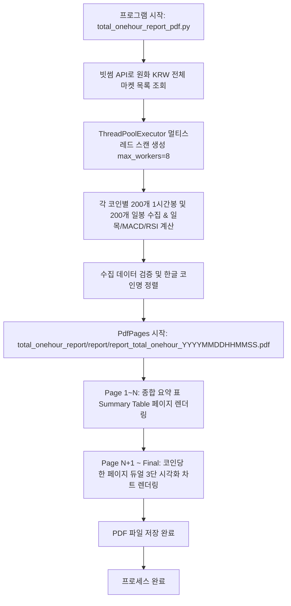

# total_onehour_report_pdf.py 프로세스 및 기술 문서

## 1. 개요 (Overview)

`total_onehour_report_pdf.py` 모듈은 **빗썸(Bithumb) 원화(KRW) 마켓에 상장된 전체 암호화폐**를 대상으로 **200개 60분봉(1시간봉) 및 200개 일봉(Daily) 데이터**를 동시에 수집·분석하여, 각 코인별 **일목균형표(전환선9, 기준선26), MACD(12,26,9), RSI(14)** 지표를 계산하고, **코인당 한 페이지 듀얼 3단 시각화(좌측: 1시간봉, 우측: 일봉)** PDF 종합 리포트를 자동 생성하는 프로그램입니다.

생성된 PDF 리포트는 `total_onehour_report/report/` 디렉터리에 타임스탬프 파일명(`report_total_onehour_YYYYMMDDHHMMSS.pdf`) 형태로 자동 저장됩니다.

---

## 2. 수집 및 분석 규격

```
                    [ 빗썸 전체 코인 1시간봉 & 일봉 데이터 분석 규격 ]
┌─────────────────────────────────────────────────────────────────────────────┐
│ 1. API 호출:                                                                │
│    - 1시간봉: https://api.bithumb.com/v1/candles/minutes/60?market={market}&count=200 │
│    - 일  봉: https://api.bithumb.com/v1/candles/days?market={market}&count=200       │
│ 2. 수집 대상: 빗썸 원화(KRW) 마켓 상장 전체 암호화폐 (약 480개)              │
│ 3. 지표 계산: 일목균형표 (9, 26, 52), MACD (12, 26, 9), RSI (14), 거래량         │
└─────────────────────────────────────────────────────────────────────────────┘
```

| 지표 항목 | 파라미터 및 설명 |
| :--- | :--- |
| **일목균형표** | `전환선(9봉)`, `기준선(26봉)`, `선행스팬1(26봉 시프트)`, `선행스팬2(52봉/26봉 시프트)` |
| **MACD** | `Short=12`, `Long=26`, `Signal=9` (MACD 선, Signal 선, Oscillator Histogram) |
| **RSI** | `Period=14` (RSI 선, 70/30 과매수/과매도 기준선) |
| **거래량** | `candle_acc_trade_volume` (진한 색상 거래량 막대 차트 TwinX Overlay) |

---

## 3. 프로세스 동작 흐름도 (Data & Execution Flow)



---

## 4. PDF 리포트 구성 및 차트 시각화 레이아웃 (1 코인 1 페이지 듀얼 3단)

### 4.1. 표지 및 종합 요약 표 페이지
- 스캔 일시, 분석 조건, 전체 대상 코인 수 표기.
- 마켓코드, 한글명, 영문명, 현재가, 60m 전환선/기준선/RSI/MACD, 일봉 전환선/기준선/RSI/MACD 요약 표 수록.

### 4.2. 코인별 듀얼 3단 차트 레이아웃 (Page 2 ~ N)
한 코인당 **1개 페이지**에 3x2 서브플롯(좌: 1시간봉 / 우: 일봉)으로 구성됩니다.

```
┌──────────────────────────────────────────┬──────────────────────────────────────────┐
│ [좌측: 1시간봉(60m)]                     │ [우측: 일봉(Daily)]                      │
├──────────────────────────────────────────┼──────────────────────────────────────────┤
│ 1단: 1시간봉 가격+일목(9,26,52)+진한거래량│ 1단: 일봉 가격+일목(9,26,52)+진한거래량 │
├──────────────────────────────────────────┼──────────────────────────────────────────┤
│ 2단: 1시간봉 MACD (12, 26, 9)            │ 2단: 일봉 MACD (12, 26, 9)               │
├──────────────────────────────────────────┼──────────────────────────────────────────┤
│ 3단: 1시간봉 RSI (14)                    │ 3단: 일봉 RSI (14)                       │
└──────────────────────────────────────────┴──────────────────────────────────────────┘
```

---

## 5. 모듈 구조 및 파일 위치

```
d:\pyprj\coinsts\
├── total_onehour_report_pdf.py             # [루트 래퍼] 메인 실행 모듈
└── total_onehour_report/
    ├── total_onehour_report_pdf.py         # [메인 모듈] 1시간봉&일봉 수집 및 PDF 생성
    ├── total_onehour_report_pdf.md         # [기술 문서] 본 문서
    └── report/                             # [PDF 저장 폴더]
        └── report_total_onehour_YYYYMMDDHHMMSS.pdf
```

---

## 6. 실행 방법

콘솔(터미널)에서 아래 명령어 중 하나를 실행합니다:

```bash
# 1. total_onehour_report 모듈 direct 실행
python total_onehour_report/total_onehour_report_pdf.py

# 2. 루트 래퍼 스크립트 실행
python total_onehour_report_pdf.py
```
